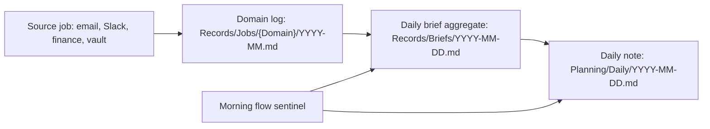

# Daily Brief Data Inputs

This guide defines the contract for adding a new information source to the daily brief and daily note flow.

## Flow



## Contract

Every source that feeds the daily brief must have:

- A schedule in `config/defaults/schedules/`.
- A registry entry in `config/defaults/daily-brief-inputs.json`.
- A domain log path: `Records/Jobs/{Domain}/YYYY-MM.md`.
- A stable job name in each log entry header.
- A `**Status:**` line.
- A concise `**Summary:**` line or section.
- A `**Flagged:**` section when Devin needs to act.
- No direct writes to `Planning/Daily/`.

Email subscription cleanup follows the same contract: the scheduled review
writes candidates to `Records/Jobs/Email/YYYY-MM.md` under `**Flagged:**`, then
Watson performs unsubscribe browser flows only after the user confirms candidates
from the Watson channel.

Optional sections:

- `**Items:**` for task-like inputs, such as Slack saved items.
- `**Known Review:**` for maintenance context that should not become a daily priority by default.

## Entry Format

```markdown
## 2026-05-25 04:30 -- Daily Email Review

**Status:** Done -- 2 items flagged
**Summary:** Archived newsletters and notifications; two threads need Devin's attention.

**Flagged:**
- Reply to Alice about the Friday scheduling change.
- Review Chase activity email for unauthorized iPad setup.
```

## Adding Email Or Another Input

1. Add or update an intent contract if the input needs agent execution.
2. Add a schedule that performs the source-specific work.
3. Add the schedule to `config/defaults/daily-brief-inputs.json` with `critical: true` if a missed run should appear in the morning sentinel.
4. Prefer deterministic post-run logging with `obsidian_log` when a short summary is enough.
5. If the source needs a rich item list, have the job write one domain-log entry itself and do not also enable `obsidian_log`.
6. Update the deterministic aggregator only if the domain introduces a new section shape that cannot be represented with `flagged`, `items`, or `overnightJobs`.
7. Add a validation case showing:
   - the source schedule writes a domain log entry,
   - the daily brief includes flagged items,
   - morning planning can turn flagged items into priorities,
   - the source does not create or mutate the daily note directly.

## Current Hardening

Three deterministic jobs protect the flow:

- `daily-note-bootstrap` runs before the agent jobs and creates or repairs today's daily note.
- `daily-brief-aggregate` reads `config/defaults/daily-brief-inputs.json`, parses recent domain logs, fetches today's calendar events, and writes `Records/Briefs/YYYY-MM-DD.md`.
- `morning-flow-sentinel` runs after the morning jobs and checks registered critical inputs for missing artifacts or failed source jobs. If the brief is missing, it creates a fallback brief and alerts. If the brief exists but upstream inputs failed, it annotates the brief with pipeline warnings.

## Rules Of Thumb

- Domain logs are append-only operational records.
- The brief is the aggregator.
- The daily note is the planning surface.
- Source jobs should never decide daily priorities directly.
- Missing or failed source jobs are themselves brief-worthy signals.
