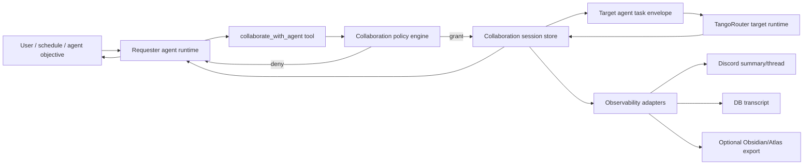

# Agent Collaboration Protocol

**Status:** Initial core request/result path implemented (2026-06-26);
presentation/export adapters remain follow-up work.
**Tracking:** Use Linear for active work breakdown, milestones, validation
evidence, and ship notes.
**Owner:** Tango runtime and agent-system maintainers

## 1. Problem And Goal

Tango agents own different responsibilities, tools, memory scopes, and user
surfaces. Today, when one agent needs another agent's capability, the system has
three weak options:

- the first agent tries to work around missing tools,
- the first agent asks the user to manually re-route the task, or
- a human/operator spawns an external session with ad hoc context.

The goal is a first-class agent-to-agent collaboration system where one agent can
ask another named Tango agent for bounded help while preserving user intent,
visibility, tool governance, privacy boundaries, and a durable audit trail.

The system should feel like capable specialists helping each other, not like an
unbounded group chat.

## 2. Product Principles

- **Goal-oriented, not chat-oriented.** Every collaboration has an explicit
  objective, requester, target, deliverable, budget, and termination condition.
- **Agents stay inside their own responsibility envelopes.** Collaboration does
  not grant the requester direct access to the target's tools, credentials,
  memory, or profile overlays.
- **Visibility is configurable and human-readable.** Users can see that
  collaboration happened, inspect enough detail to trust it, and opt into richer
  transcripts where appropriate.
- **Profile-first adaptability.** Repo defaults define generic capability shapes;
  real users, channel IDs, tool endpoints, private responsibilities, and display
  details live in profile overlays/config.
- **Deterministic safety, model judgment.** Code owns routing, budgets,
  permissions, audit records, and loop prevention. Agents own reasoning,
  synthesis, and judgment inside those rails.
- **No hidden privilege laundering.** Asking another agent is allowed because
  that agent has an approved role and tools, not because the requester found a
  back door around governance.

## 3. Non-Goals

- General-purpose autonomous agent socializing.
- Letting agents recursively route work forever.
- Sharing raw private memory or profile overlays between agents by default.
- Reintroducing retired worker-dispatch markup as prompt-visible scaffolding.
- Requiring Discord as the transport for internal collaboration.
- Storing profile-specific or personal operational details in tracked repo docs.

## 4. User Experience

### 4.1 Default Visible Behavior

When collaboration is useful, the requester tells the user what is happening in
plain language:

```text
I am going to ask the finance agent to verify the reimbursement status, then I
will summarize the result here.
```

For short, low-risk reads, that may be the only live visible update. When the
target completes, the requester posts the final answer with an attribution line:

```text
Checked with Finance. The receipt is already attached; the remaining step is
manager approval.
```

### 4.2 Rich Visibility Modes

Visibility is a per-profile and per-agent policy:

| Mode | User-facing behavior | Use when |
| --- | --- | --- |
| `summary` | Only start/completion summaries are posted to the user's current surface. | Default for most users and channels. |
| `digest` | A compact collaboration log is posted after completion, including agents, task, tools used, result, and handoff notes. | Scheduled/autonomous responsibilities and background triage. |
| `thread` | A Discord thread receives visible collaboration messages. The requester still owns the final answer. | Debugging, high-trust power users, implementation work, or long-running tasks. |
| `transcript` | Full transcript is saved to the runtime DB and optionally exported to Obsidian/Atlas; Discord receives a summary with a pointer. | Audits, sensitive operations, or postmortems. |
| `silent` | No Discord output unless escalation or failure occurs; durable audit still records the collaboration. | Noisy scheduled jobs where the user requested low noise. |

The profile chooses defaults. Individual responsibilities can override them.

### 4.3 Discord Presentation

Discord is an observer surface, not the required collaboration bus.

Supported presentation patterns:

- **Requester summary in the existing channel/thread.** Lowest noise.
- **Collaboration thread.** Tango creates or reuses a thread named from the task
  and posts each visible event there.
- **Webhook persona messages.** Tango may use existing reply-presentation
  support to post target-agent messages with that agent's display name/avatar.
- **Audit digest channel.** A dedicated profile-configured channel receives
  collaboration digests for autonomous responsibilities.

Discord implementation should use webhook/bot APIs only as presentation
adapters. Core state lives in Tango storage so missed Discord delivery does not
erase the collaboration record.

## 5. Core Concepts

### Agent Responsibility Envelope

Each agent should have explicit responsibilities in v2 config/profile overlay.
Responsibilities describe what the agent is expected and allowed to pursue, not
just what tools are mounted.

Proposed generic config shape:

```yaml
responsibilities:
  - id: email_triage
    description: Review inboxes, classify messages, draft replies, and escalate
      messages needing user judgment.
    objectives:
      - Keep actionable email surfaced.
      - Draft but do not send unless policy allows it.
    allowed_initiators:
      agents: ["operations"]
      schedules: ["morning-planning"]
    autonomy:
      default: supervised
      writes_require_confirmation: true
      purchase_or_payment: never
    collaboration:
      can_request:
        - agent: research
          purposes: ["source-check", "vendor-comparison"]
      can_fulfill:
        - purpose: "email-thread-brief"
          max_turns: 1
          max_duration_seconds: 120
```

Repo defaults should ship generic placeholders. Profile overlays fill in
installation-specific responsibilities, account mappings, channels, and
autonomy choices.

### Collaboration Session

A collaboration session is the top-level durable record.

Required fields:

- `id`
- `requester_agent_id`
- `target_agent_id`
- `initiator_kind`: `user`, `agent`, `schedule`, `system`
- `initiator_ref`: message, schedule, issue, or workflow reference
- `objective`
- `deliverable_contract`
- `status`: `proposed`, `running`, `waiting_on_user`, `completed`, `failed`,
  `canceled`, `denied`, `expired`
- `visibility_mode`
- `user_surface_ref`: current Discord channel/thread or other surface
- `created_at`, `updated_at`, `expires_at`
- budget fields: max turns, max tool calls, max duration, max cost when known

### Collaboration Turn

A collaboration turn is one bounded request from requester to target or one
result/clarification from target to requester.

Turn types:

- `request`
- `clarification`
- `result`
- `status`
- `escalation`
- `error`

Every turn records sender, recipient, content, structured metadata, visible
surface refs, model/run refs, and tool-use summaries when available.

### Delegation Grant

A delegation grant is a deterministic policy decision that says the requester is
allowed to ask the target for this objective. It does not transfer tool
permissions.

Inputs:

- requester agent principal
- target agent principal
- target responsibility/purpose
- user/session/channel/schedule context
- requested autonomy level
- requested tool domains if known

Outputs:

- `granted` or `denied`
- allowed scope and budget
- confirmation requirement, if any
- reason/audit context

## 6. Architecture



The requester receives only the target's bounded result, not the target's full
runtime context. The target receives a task envelope, not the requester's full
private conversation by default.

## 7. Protocol

### 7.1 Request Envelope

The requester calls a new MCP tool, tentatively `collaborate_with_agent`.

Input:

```json
{
  "target_agent_id": "finance",
  "purpose": "receipt-status-check",
  "objective": "Verify whether the receipt for the current reimbursement is already attached.",
  "context_summary": "The user is asking about a pending reimbursement. Do not submit anything.",
  "deliverable": {
    "format": "concise_result",
    "required_fields": ["status", "evidence", "next_step"],
    "max_words": 180
  },
  "constraints": [
    "No purchases or payment actions.",
    "Do not send email.",
    "Ask for clarification if account identity is ambiguous."
  ],
  "visibility": "summary",
  "budget": {
    "max_turns": 1,
    "max_duration_seconds": 120,
    "max_tool_calls": 5
  }
}
```

The tool validates:

- requester can initiate this target/purpose,
- target can fulfill this purpose,
- visibility mode is allowed on the current surface/profile,
- requested autonomy does not exceed the target responsibility envelope,
- budget is inside policy bounds.

### 7.2 Target Task Envelope

The target agent receives a synthetic user/task message with explicit source and
scope:

```text
Collaboration request from agent:operations.

Objective: Verify whether the receipt for the current reimbursement is already
attached.

Context summary: The user is asking about a pending reimbursement. Do not submit
anything.

Deliverable: Return concise_result JSON with status, evidence, and next_step.

Constraints:
- No purchases or payment actions.
- Do not send email.
- Ask for clarification if account identity is ambiguous.

This is a bounded collaboration turn. Answer the objective, request one
clarification if blocked, or return failed with the reason. Do not continue the
conversation unless the requester asks a follow-up inside the same session.
```

The target runtime uses its own v2 config, prompt assembly, MCP allowlist,
governance principal, memory scope, and profile overlays.

### 7.3 Result Contract

The target returns structured output:

```json
{
  "status": "completed",
  "answer": "The receipt is attached. The next step is manager approval.",
  "evidence": [
    {
      "kind": "tool_result",
      "summary": "Reimbursement record showed receipt_present=true."
    }
  ],
  "actions_taken": ["read reimbursement status"],
  "actions_not_taken": ["no submission", "no email sent"],
  "needs_user": false
}
```

The requester synthesizes this into its own final response. If the target asks a
clarification, the requester decides whether to ask the user, answer from
available context, or cancel.

## 8. Loop Prevention

The collaboration runtime must make endless agent chatter structurally hard.

Controls:

- **No open-ended target turns.** Every request has `max_turns`; default is one
  request and one result.
- **Depth cap.** A collaboration spawned from another collaboration has
  `parent_collaboration_id`; default max depth is 1. Higher depth requires
  explicit profile policy.
- **Active inbound guard.** If an agent is currently serving an inbound
  collaboration, any onward collaboration request must carry explicit parent
  context; otherwise the policy records a denial instead of starting a new root
  session.
- **No symmetric auto-reply.** A target result is returned to the requester as a
  tool result, not injected as a new unsolicited message that triggers normal
  routing.
- **Per-session TTL.** Sessions expire quickly by default.
- **Duplicate objective suppression.** If the same requester, target, purpose,
  and normalized objective repeat within a short window, the tool returns the
  existing result or asks for user confirmation.
- **Clarification limit.** The target may ask at most one clarification in the
  default policy. Further ambiguity returns `blocked`.
- **No "keep me posted" behavior.** Follow-ups require a schedule, active task,
  or explicit user/requester action.
- **Model prompt rail.** Target envelope says to answer, clarify once, or fail;
  never to continue socially.
- **Watchdog.** A deterministic cleanup job expires running sessions that exceed
  their budget and posts a failure event if visibility policy requires it.

## 9. Tool Security And Governance

Collaboration is an audited invocation path, not a new permission inheritance
path.

Rules:

- Requester permissions are checked for `collaborate_with_agent`.
- Target permissions are checked normally for every target tool call.
- The requester never receives raw target credentials, raw profile overlays, or
  target MCP handles.
- Target write operations follow the target's normal confirmation and autonomy
  policy.
- User-confirmation requirements survive delegation. If the target cannot
  perform a write without confirmation in a direct user conversation, it cannot
  perform that write because another agent asked.
- The target should see only the minimum context required: preferably a
  requester-authored summary plus explicit source refs, not full transcript
  dumps.
- For sensitive domains, collaboration may require a user-visible preflight:
  "I need the finance agent to check this. It can read reimbursement records but
  will not submit anything. Continue?"

Implementation should extend existing governance tables or add sibling tables:

- register `collaborate_with_agent` as a governance tool,
- add delegation-specific audit events,
- log target tool checks under the target principal,
- link target model runs/tool summaries to the collaboration session.

## 10. Privacy And Profile Layer

The repo ships generic collaboration schema and safe defaults only.

Profile-owned configuration supplies:

- real agent display names/callsigns,
- real Discord channels, guilds, threads, and webhook appearance,
- private responsibility definitions,
- account/vendor/person mappings,
- per-user autonomy policy,
- per-agent collaboration allowlists,
- Obsidian/Atlas export paths,
- digest-channel choices.

Memory and context rules:

- Target agents use their own configured memory scope.
- Requester summaries may include user-provided facts needed for the task, but
  should avoid copying unrelated private context.
- Cross-agent memory writes are not automatic. If a collaboration result is
  worth durable recall, the requester or a post-turn hook writes an explicit
  summary under the appropriate memory scope.
- Full transcripts are runtime data. If exported to Obsidian/Atlas, export only
  according to profile policy and classification.

## 11. Observability And Records

Minimum durable records:

- collaboration session row,
- one row per collaboration turn,
- policy decision/audit record,
- target model run refs,
- target tool-use summary,
- presentation delivery refs for Discord or other surfaces,
- final requester synthesis ref.

Recommended tables:

```sql
CREATE TABLE agent_collaboration_sessions (
  id TEXT PRIMARY KEY,
  parent_collaboration_id TEXT,
  requester_agent_id TEXT NOT NULL,
  target_agent_id TEXT NOT NULL,
  initiator_kind TEXT NOT NULL,
  initiator_ref TEXT,
  purpose TEXT NOT NULL,
  objective TEXT NOT NULL,
  deliverable_contract_json TEXT NOT NULL,
  status TEXT NOT NULL,
  visibility_mode TEXT NOT NULL,
  user_surface_json TEXT,
  budget_json TEXT NOT NULL,
  policy_decision_json TEXT,
  result_summary TEXT,
  error TEXT,
  created_at TEXT NOT NULL DEFAULT (datetime('now')),
  updated_at TEXT NOT NULL DEFAULT (datetime('now')),
  expires_at TEXT
);

CREATE TABLE agent_collaboration_turns (
  id TEXT PRIMARY KEY,
  collaboration_id TEXT NOT NULL,
  turn_index INTEGER NOT NULL,
  sender_agent_id TEXT NOT NULL,
  recipient_agent_id TEXT NOT NULL,
  turn_type TEXT NOT NULL,
  content TEXT NOT NULL,
  structured_json TEXT,
  model_run_id INTEGER,
  visible_message_ref TEXT,
  created_at TEXT NOT NULL DEFAULT (datetime('now')),
  FOREIGN KEY (collaboration_id) REFERENCES agent_collaboration_sessions(id)
);
```

Discord digest fields:

- requester,
- target,
- objective,
- status,
- elapsed time,
- tools used by target,
- actions taken,
- actions explicitly not taken,
- user action needed,
- transcript/export pointer when enabled.

## 12. Runtime Integration

### 12.1 Core Service

Add an `AgentCollaborationService` in core or discord runtime wiring that owns:

- request validation,
- delegation policy,
- session creation/update,
- target runtime invocation through `TangoRouter`,
- result normalization,
- observability dispatch,
- expiry cleanup.

The initial implementation provides the core request/result service, v2
responsibility policy evaluation, durable session/turn storage, target runtime
invocation through `TangoRouter`, duplicate suppression, active-inbound loop
guarding, and result normalization. Visibility beyond the stored audit trail is
still an adapter concern.

### 12.2 MCP Tool

Expose `collaborate_with_agent` through an MCP domain such as `collaboration`.

Only agents that may request help should have it in `mcp_servers`. Governance
still controls which requesters can use it.

### 12.3 Conversation Keys

Target runtime invocations should use collaboration-scoped conversation keys:

```text
collab:{collaboration_id}:{target_agent_id}
```

This avoids contaminating user-facing channel/thread sessions and prevents two
visible agents in the same Discord channel from force-resetting each other's
runtime context.

### 12.4 Presentation

Use existing reply presentation/webhook support for visible Discord output. Add
a small presentation adapter that can post:

- start event,
- target status event,
- completion digest,
- failure/escalation message,
- optional per-turn transcript message in a collaboration thread.

Presentation failures should mark delivery refs as failed but not fail the
collaboration unless visibility is required by policy.

## 13. Autonomous Responsibilities

Responsibilities such as inbox triage can initiate collaboration without a
direct user command when their config permits it.

Required safeguards:

- the schedule/responsibility is the initiator ref,
- autonomy policy explicitly allows the action class,
- writes above the configured risk level require user confirmation,
- digests summarize autonomous collaborations,
- repeated autonomous failures back off and create an active task or Linear issue
  rather than retrying indefinitely.

Example:

1. Email triage agent scans messages.
2. It asks research agent for source verification on one suspicious claim.
3. Research returns evidence and confidence.
4. Email triage drafts a reply but does not send.
5. Digest says which agents collaborated and what is waiting for the user.

## 14. Implementation Plan

### Phase 0: Discovery And Tracking

- Create Linear project with standard milestones.
- Confirm initial target use cases and default visibility policy.
- Inventory existing agents' safe collaboration purposes.

### Phase 1: Data Model And Policy

- Add collaboration tables and migrations.
- Add config schema for responsibilities/collaboration policy.
- Register `collaborate_with_agent` in governance.
- Add policy engine with unit tests for grants, denials, budgets, depth caps,
  and confirmation requirements.

### Phase 2: Core Invocation Path

- Implement `AgentCollaborationService`.
- Add MCP tool and target task envelope.
- Invoke target agents through `TangoRouter` using collaboration-scoped
  conversation keys.
- Store turns, model refs, result summaries, and errors.

### Phase 3: Observability

- Add summary/digest presentation.
- Add optional Discord collaboration thread mode.
- Add transcript/export hooks for profile-configured Obsidian/Atlas destinations.
- Add CLI/operator inspection command.

### Phase 4: Responsibility Rollout

- Add generic responsibility config fields to repo defaults.
- Add profile-overlay examples in docs without real private values.
- Enable one low-risk read-only collaboration path first.
- Expand to supervised write workflows only after validation.

### Phase 5: Validation

- Unit tests for policy, config parsing, storage, loop prevention, and result
  normalization.
- Integration tests with stub requester/target runtimes.
- Discord smoke test in test channels for summary and thread visibility.
- Privacy scan to verify no profile/private data entered repo defaults.
- Live validation on one read-only task before enabling write-capable paths.

## 15. Acceptance Criteria

- An agent can request bounded help from another named agent and receive a
  structured result.
- Target tool calls run only under the target agent's existing governance and
  MCP allowlist.
- Collaboration cannot exceed configured turn/depth/time/tool budgets.
- A target result does not trigger an automatic conversational loop.
- Users can see a summary or digest in the configured surface.
- Full collaboration state is recoverable from Tango storage after restart.
- Profile overlays can customize responsibilities, visibility, channels, and
  autonomy without editing tracked repo files.
- Tests prove denial paths and loop-prevention behavior.

## 16. Open Questions

- Should collaboration purposes be modeled as config only, or also as governance
  tools/resources so permission queries can answer "which agents may ask which
  specialists for what"?
- Should the target be allowed to return machine-readable source refs that the
  requester can re-read, or should evidence stay summarized by default?
- What is the default retention period for full transcripts?
- Should Obsidian export be automatic for `transcript` mode, or should Atlas/DB
  be canonical with Obsidian export only on demand?
- Which first production workflow should validate the path: read-only finance,
  email triage, research support, or developer/operations collaboration?

## 17. External Platform Notes

Discord supports the presentation patterns this spec depends on:

- bot-created messages for normal channel/thread output,
- webhooks with per-message username/avatar overrides for agent persona display,
- thread targeting for webhook messages where the deployment has configured the
  channel/thread correctly.

Use Discord as an output adapter and audit surface, not as the source of truth
for collaboration state.

References:

- Discord Developer Docs, Channel Resource:
  <https://discord.com/developers/docs/resources/channel>
- Discord Developer Docs, Webhook Resource:
  <https://discord.com/developers/docs/resources/webhook>
