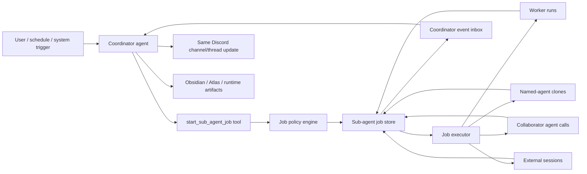

# Sub-Agent Job Architecture

**Status:** Draft design spec, Discovery
**Date:** 2026-07-02
**Tracking:** Linear project "Sub-Agent Job Architecture"; active issue TGO-793
**Related:** `docs/specs/agent-collaboration.md`, TGO-624 (superseded)

## 1. Purpose

Tango should support real sub-agent work: a main/coordinating agent can start
one or more background jobs, let them run in parallel, receive their results or
blockers, and decide when to update the user.

The model should feel like the main agent is managing a small workstream on the
user's behalf. The user should not have to repeatedly ask for status when there
is a meaningful update, but the sub-agents themselves should not become a noisy
group chat.

## 2. Locked Product Decisions

- A single substrate should support both:
  - named-agent jobs: additional instances of Watson, Sierra, Foxtrot, Malibu,
    Victor, or another configured Tango agent
  - task-worker jobs: anonymous focused workers for one task or one branch of
    research
- Jobs must run in parallel when their dependencies permit it.
- The main/coordinating agent mediates user-facing updates.
- User-facing updates go back to the same Discord channel or thread where the
  job was spawned unless a future explicit policy overrides it.
- Jobs may cover research, browser/login workflows, named-agent collaboration,
  artifact creation, and longer-running operational work.
- Meaningful updates are contextual. Baseline update reasons are completion,
  blocker/user input needed, failure, long-running periodic status, and
  important intermediate artifact availability.
- Human-readable reports and artifacts should generally land in Obsidian.
  Full transcripts and raw tool logs are runtime/Atlas data unless promoted to
  a human-facing report.

## 3. Existing Primitives

### 3.1 Agent Collaboration

`collaborate_with_agent` already implements a bounded request/result path
between named agents:

- responsibility-based policy grants
- target-agent tool and memory isolation
- turn/depth/time/tool budgets
- duplicate suppression
- collaboration-scoped conversation keys
- durable collaboration session and turn records

This is the right policy foundation for peer collaborator jobs, but it is
synchronous and returns one result to the requester. It is not a durable
background job queue.

### 3.2 Spawn Sub Agents

`spawn_sub_agents` already implements a synchronous batch runner for focused
task workers:

- task list, dependencies, concurrency, timeout, max rounds, max total agents
- provider fallback across Claude/Codex providers
- tool allowlist per sub-task
- structured research quality gate
- `sub_agent_runs` observability rows

It is currently dormant in v2 agent configs. Before enablement, its MCP worker
environment should be repaired: the worker provider helper emits
`TANGO_WORKER_ID` / `TANGO_ALLOWED_TOOL_IDS`, while the MCP server/proxy paths
read `WORKER_ID` / `ALLOWED_TOOL_IDS`.

### 3.3 Scheduler And Delivery

The scheduler already supports proactive Discord delivery for scheduled jobs and
failure alerts. That delivery path can be reused, but sub-agent jobs need an
event-driven notifier instead of only schedule-result delivery.

## 4. Goals

- Start background work from an interactive agent turn and return a durable job
  handle immediately when appropriate.
- Support multiple concurrent jobs and multiple concurrent children per job.
- Let the coordinator inspect job status, results, blockers, artifacts, and
  tool summaries.
- Let the coordinator synthesize user-facing updates and final answers.
- Keep access control explicit and auditable.
- Preserve restart recovery: running jobs should be marked expired or resumed
  according to policy.
- Keep profile/private details out of repo defaults.

## 5. Non-Goals

- Unbounded autonomous agent society.
- Direct sub-agent posting to user channels by default.
- Letting a parent agent launder tool access through a worker.
- Making Discord the internal execution bus.
- Storing full raw transcripts in Obsidian by default.
- Replacing existing scheduled jobs; the scheduler can become one initiator of
  sub-agent jobs.

## 6. Core Concepts

### 6.1 Sub-Agent Job

A durable parent record for background work requested by a user, schedule,
agent, or system. A job owns lifecycle, user surface, coordinator, children,
events, artifacts, and notification policy.

Example statuses:

- `queued`
- `running`
- `waiting_on_user`
- `blocked`
- `completed`
- `failed`
- `canceling`
- `canceled`
- `expired`

### 6.2 Child Run

One executable unit under a job. A child run may be:

- `worker`: an anonymous task worker with a parent-inherited capability ceiling
- `named_agent`: a new isolated runtime instance of a configured Tango agent
- `collaborator`: a peer named agent invoked through collaboration policy
- `external_session`: a spawned Codex/Claude Code/tmux session, if explicitly
  requested by a tool or operator workflow

### 6.3 Coordinator

The agent that started or owns the job. It is responsible for:

- decomposing work
- choosing worker vs named collaborator shape
- deciding what context each child receives
- deciding which events deserve user-facing updates
- synthesizing final results
- requesting user input when needed

### 6.4 Event

An append-only job event, visible to code and optionally to the coordinator.
Events are not automatically user-facing.

Common event types:

- `job_started`
- `child_started`
- `child_progress`
- `artifact_ready`
- `child_blocked`
- `child_failed`
- `child_completed`
- `job_waiting_on_user`
- `job_completed`
- `job_failed`
- `notification_sent`
- `canceled`
- `expired`

### 6.5 Artifact

A durable output created by a job or child run:

- Obsidian report path
- Atlas memory/log reference
- runtime transcript reference
- file attachment
- browser capture
- structured JSON result
- Linear issue/update link

Artifacts should be typed, attributed, and linked to the producing child run.

## 7. Execution Modes

### 7.1 Worker Mode

Worker mode is for anonymous focused tasks.

Policy:

- The worker's tool surface is a subset of the coordinator's allowed tool
  surface unless an explicit system policy grants a narrower special-purpose
  worker principal.
- The coordinator can choose the subset of tools needed for the task, but cannot
  exceed its inherited ceiling.
- Worker output should be compact and structured.
- Worker memory writes are disabled by default unless a task-specific policy
  allows a summary write.

Use cases:

- parallel research branches
- independent document reads
- candidate comparison
- OCR or extraction fallback
- low-risk read-only data gathering

### 7.2 Named-Agent Clone Mode

Named-agent clone mode is for running an additional isolated instance of a
configured Tango agent.

Policy:

- The clone uses the named agent's prompt, profile overlay, memory scope, and
  normal tool governance.
- The runtime conversation key is job-scoped, not channel-scoped.
- The clone does not post directly to the user.
- The coordinator receives structured events/results from the clone.

Use cases:

- two Sierra research branches in parallel
- Malibu inspecting a wellness-related data set while Watson continues
  coordination
- Foxtrot handling a finance lookup while Watson manages the broader user task

### 7.3 Collaborator Mode

Collaborator mode is for peer agents with different access controls or
responsibilities.

Policy:

- This should reuse and extend `AgentCollaborationService`.
- The collaborator runs under its own responsibility envelope and governance.
- The coordinator cannot grant access the collaborator does not have.
- The collaborator cannot use peer access to bypass confirmation requirements.

Use cases:

- Watson asks Foxtrot for a finance status.
- Victor asks Sierra for source verification.
- A schedule asks Watson to coordinate with Sierra before writing a digest.

### 7.4 External Session Mode

External session mode wraps existing Codex/Claude Code spawning when the desired
worker is a human-resumable development session rather than an in-runtime
sub-agent.

Policy:

- Treat the external session as a child run with weaker introspection.
- Status watchers must foreground-verify before emitting state transitions,
  due to known background watcher false positives.
- External sessions should not be the default for ordinary research or agent
  collaboration.

## 8. Architecture



Internal execution and state live in Tango storage. Discord is a presentation
surface. Obsidian and Atlas are artifact/retention surfaces.

## 9. Proposed Data Model

```sql
CREATE TABLE sub_agent_jobs (
  id TEXT PRIMARY KEY,
  parent_job_id TEXT,
  coordinator_agent_id TEXT NOT NULL,
  initiator_kind TEXT NOT NULL,
  initiator_ref TEXT,
  user_surface_json TEXT NOT NULL,
  objective TEXT NOT NULL,
  normalized_objective TEXT NOT NULL,
  status TEXT NOT NULL,
  priority INTEGER NOT NULL DEFAULT 0,
  visibility_mode TEXT NOT NULL DEFAULT 'summary',
  notification_policy_json TEXT NOT NULL DEFAULT '{}',
  budget_json TEXT NOT NULL DEFAULT '{}',
  policy_decision_json TEXT,
  result_summary TEXT,
  error TEXT,
  created_at TEXT NOT NULL DEFAULT (datetime('now')),
  updated_at TEXT NOT NULL DEFAULT (datetime('now')),
  expires_at TEXT,
  FOREIGN KEY (parent_job_id) REFERENCES sub_agent_jobs(id) ON DELETE SET NULL
);

CREATE TABLE sub_agent_child_runs (
  id TEXT PRIMARY KEY,
  job_id TEXT NOT NULL,
  kind TEXT NOT NULL,
  agent_id TEXT,
  worker_id TEXT,
  provider_name TEXT,
  model TEXT,
  conversation_key TEXT,
  task TEXT NOT NULL,
  depends_on_json TEXT NOT NULL DEFAULT '[]',
  tool_ids_json TEXT NOT NULL DEFAULT '[]',
  status TEXT NOT NULL,
  started_at TEXT,
  finished_at TEXT,
  heartbeat_at TEXT,
  duration_ms INTEGER,
  cost_estimate_usd REAL,
  result_summary TEXT,
  error TEXT,
  metadata_json TEXT,
  FOREIGN KEY (job_id) REFERENCES sub_agent_jobs(id) ON DELETE CASCADE
);

CREATE TABLE sub_agent_job_events (
  id TEXT PRIMARY KEY,
  job_id TEXT NOT NULL,
  child_run_id TEXT,
  event_type TEXT NOT NULL,
  severity TEXT NOT NULL DEFAULT 'info',
  title TEXT,
  body TEXT,
  structured_json TEXT,
  visible_message_ref TEXT,
  created_at TEXT NOT NULL DEFAULT (datetime('now')),
  FOREIGN KEY (job_id) REFERENCES sub_agent_jobs(id) ON DELETE CASCADE,
  FOREIGN KEY (child_run_id) REFERENCES sub_agent_child_runs(id) ON DELETE CASCADE
);

CREATE TABLE sub_agent_artifacts (
  id TEXT PRIMARY KEY,
  job_id TEXT NOT NULL,
  child_run_id TEXT,
  artifact_type TEXT NOT NULL,
  title TEXT,
  uri TEXT NOT NULL,
  summary TEXT,
  metadata_json TEXT,
  created_at TEXT NOT NULL DEFAULT (datetime('now')),
  FOREIGN KEY (job_id) REFERENCES sub_agent_jobs(id) ON DELETE CASCADE,
  FOREIGN KEY (child_run_id) REFERENCES sub_agent_child_runs(id) ON DELETE SET NULL
);
```

`sub_agent_runs` can either be migrated into `sub_agent_child_runs` or retained
as a compatibility view/table for the existing synchronous `spawn_sub_agents`
batch path.

## 10. Tool Surface

### 10.1 `start_sub_agent_job`

Starts a durable background job and returns a job handle.

Input shape:

```json
{
  "objective": "Compare three implementation paths for durable background jobs.",
  "children": [
    {
      "id": "storage",
      "kind": "worker",
      "task": "Review the storage and scheduler implications.",
      "tools": ["file_ops"],
      "output_schema": "job_evidence_v1"
    },
    {
      "id": "runtime",
      "kind": "named_agent",
      "agent_id": "sierra",
      "task": "Evaluate runtime and provider implications."
    }
  ],
  "notification_policy": {
    "mode": "coordinator_mediated",
    "periodic_after_minutes": 10,
    "notify_on": ["blocked", "failed", "artifact_ready", "completed"]
  },
  "budget": {
    "max_children": 6,
    "max_duration_minutes": 45,
    "max_parallel": 3
  }
}
```

Output:

```json
{
  "job_id": "uuid",
  "status": "queued",
  "child_run_ids": ["uuid"],
  "user_surface": {
    "kind": "discord",
    "channel_id": "...",
    "thread_id": "..."
  }
}
```

### 10.2 `get_sub_agent_job`

Returns current job status, children, latest events, and artifact refs.

### 10.3 `list_sub_agent_jobs`

Lists active/recent jobs for the coordinator, conversation, or user surface.

### 10.4 `cancel_sub_agent_job`

Requests cancellation. Child runs should be aborted when possible and otherwise
marked canceled/expired after a timeout.

### 10.5 `send_sub_agent_job_update`

Coordinator-only helper to post a user-facing update tied to a job. This tool
uses the recorded user surface and writes a message record so future replies
warm-start correctly.

This separation keeps raw child events internal while preserving coordinator
judgment over user-facing communication.

## 11. Notification Semantics

Sub-agent children emit events. The coordinator decides what reaches the user.

The system should support two coordinator update paths:

1. Pull: the coordinator calls `get_sub_agent_job` during a later turn.
2. Push: a lightweight job monitor wakes the coordinator when events satisfy
   notification policy.

Default notify candidates:

- job completed
- child failed
- child blocked and needs user input
- artifact ready and useful before final completion
- job exceeded `periodic_after_minutes` without a user-visible update
- job exceeded budget or expired

The push path should not let child agents message the user directly. Instead,
it should create a coordinator wake event or scheduled coordinator turn with a
small event digest:

```text
Job update available:
- job_id: ...
- reason: child_blocked
- user_surface: discord thread ...
- latest_events: [...]
Decide whether and how to update the user.
```

If the coordinator is unavailable, a deterministic fallback can post a minimal
system-style failure or "needs input" message only for high-severity events.

## 12. User Surface And Message Recording

Every job records a `user_surface_json` at spawn time. For Discord:

```json
{
  "kind": "discord",
  "channel_id": "parent-or-thread-channel-id",
  "thread_id": "optional-thread-id",
  "session_id": "resolved Tango session id",
  "message_id": "spawn request message id"
}
```

User-facing updates should:

- post to the same channel/thread by default
- use the coordinator agent persona
- write the outbound message to Tango message storage
- include `job_id` in metadata
- avoid raw transcript dumps

## 13. Context And Access Policy

### Worker Access

Worker child runs receive:

- task envelope
- minimal context summary
- explicit tool subset
- budget and output contract
- artifact instructions

They do not receive:

- full parent transcript by default
- parent credentials directly
- tools outside the inherited ceiling
- automatic memory write permission

### Named-Agent Access

Named-agent clones receive:

- their own v2 prompt and profile overlays
- their own memory scope
- their own normal tool governance
- a job-scoped conversation key
- a task envelope from the coordinator

They do not receive the parent agent's raw private runtime context unless the
coordinator explicitly summarizes or attaches it.

### Collaborator Access

Collaborators use the existing responsibility/collaboration policy:

- requester must be allowed to ask target for the purpose
- target must be allowed to fulfill that purpose
- target writes and confirmations follow target policy
- requester cannot inherit target tools

## 14. Artifacts And Retention

Recommended default:

- Obsidian: human-readable reports, decision packets, final research notes,
  links to useful outputs, and append-only monthly job ledger entries.
- Tango storage: job records, child runs, events, tool summaries, delivery refs.
- Atlas: compact durable summaries, transcript/tool-log references when useful,
  and searchable facts that should survive beyond one job.
- Raw transcripts: retained in runtime storage according to profile retention
  policy, not exported to Obsidian by default.

Vault-writing behavior:

- Resolve the vault root from the same profile/env path used by existing
  Obsidian integrations.
- For background/scheduled work, prefer direct filesystem I/O over
  obsidian-cli/app-mediated writes so automated jobs do not steal focus.
- Use the existing monthly domain-log pattern for the fleet-visible job ledger:
  `Records/Jobs/SubAgents/YYYY-MM.md`.
- Keep sub-agent source jobs out of direct `Planning/Daily/` mutation. If a
  sub-agent job produces daily-brief-worthy output, write a domain log entry and
  let the existing brief/planning aggregation path decide how it appears.
- Richer human reports can live in the appropriate vault area, such as
  `Research/`, `Records/`, or a project/thread note. The job ledger should link
  to them rather than duplicate them.

Daily ledger idea:

```markdown
## 2026-07-02 09:14 -- Sub-Agent Job

**Status:** Done -- 3 child runs completed
**Coordinator:** Watson
**Surface:** channel:... thread:...
**Summary:** Compared implementation paths for durable sub-agent jobs.
**Artifacts:** [[Sub-Agent Job Architecture Research]]

**Children:**
- storage worker -- completed
- runtime worker -- completed
- notification worker -- completed

**Flagged:**
- None
```

The ledger should be generated from job events, not manually maintained by the
model. It should follow the existing `Records/Jobs/{Domain}/YYYY-MM.md` shape:
stable header, `**Status:**`, `**Summary:**`, optional `**Flagged:**`, and
links to artifacts.

## 15. Recovery And Watchdogs

On Tango restart:

- `queued` jobs may resume if they have not expired.
- `running` child runs without a heartbeat are marked `expired` or requeued
  according to kind and policy.
- external sessions require foreground verification before status transitions.
- user-facing failure messages are coordinator-mediated unless severity policy
  permits deterministic fallback.

Every child run should heartbeat when possible. For CLI/provider calls that
cannot heartbeat internally, the executor can heartbeat before/after the call
and rely on timeout enforcement.

## 16. Relationship To Existing Systems

### Agent Collaboration

Keep `AgentCollaborationService` as the named peer-collaboration policy engine.
Add an async wrapper that can create a `collaborator` child run and record
events/artifacts around the existing request/result invocation.

### Spawn Sub Agents

Move `runSubAgentBatch` behind the durable job executor or adapt it so one
`spawn_sub_agents` call creates child runs. Keep the quality-gate logic; replace
the current synchronous-only MCP surface with job-aware tools.

### Scheduler

The scheduler can become an initiator of jobs and can provide delivery helpers,
but job monitoring should be event-driven and job-scoped rather than encoded as
many schedule YAML files.

### External Claude/Codex Sessions

Model external sessions as one child-run kind. They are useful for human-resume
development flows, not the default for in-runtime sub-agent work.

## 17. Implementation Plan

### Phase 0: Discovery And Spec

- Draft this design.
- Confirm terminology and MVP scope.
- Keep active tracking in Linear project "Sub-Agent Job Architecture".
- Cancel/supersede TGO-624.

### Phase 1: Storage And Policy

- Add job, child-run, event, and artifact tables.
- Add config schema for job notification policy and worker capability ceilings.
- Add governance rows for new job tools.
- Add unit tests for lifecycle, access policy, duplicate suppression, and
  inherited-ceiling enforcement.

### Phase 2: Job Executor

- Implement `SubAgentJobService`.
- Implement worker child runs using repaired MCP env and existing provider
  fallback.
- Implement named-agent clone child runs using job-scoped conversation keys.
- Wrap existing `AgentCollaborationService` for collaborator child runs.
- Add cancellation and timeout handling.

### Phase 3: Coordinator Event Inbox And Updates

- Add `get_sub_agent_job`, `list_sub_agent_jobs`, and
  `send_sub_agent_job_update`.
- Add event-driven coordinator wake mechanism.
- Reuse Discord delivery/message-recording path for same-thread updates.
- Add deterministic high-severity fallback only for failures/blockers.

### Phase 4: Artifact Retention

- Add Obsidian report/ledger writer from structured job artifacts.
- Add Atlas/runtime references for transcripts and tool logs.
- Add profile configuration for retention/export policy.
- Write the monthly sub-agent ledger with direct vault file I/O at
  `Records/Jobs/SubAgents/YYYY-MM.md`.

### Phase 5: Rollout

- Enable one read-only MVP path first:
  - coordinator starts 2-3 worker children for research
  - child events record internally
  - coordinator posts completion summary to same thread
  - Obsidian report artifact is linked
- Then enable named-agent clone jobs.
- Then enable collaborator child jobs through the existing collaboration policy.
- Browser/login/write workflows require explicit confirmation and validation.

## 18. Acceptance Criteria

- A coordinator can start a durable job and receive a job id without blocking on
  all child work.
- Multiple child runs execute in parallel up to policy limits.
- Worker child runs cannot exceed the coordinator's inherited capability
  ceiling.
- Named-agent/collaborator child runs use their own configured governance and
  job-scoped conversation keys.
- Child agents never directly post to the user by default.
- The coordinator can inspect status/events/artifacts and post an update to the
  original Discord channel/thread.
- Completion, blocker, failure, and long-running periodic update paths work.
- Job state survives restart; stale running jobs are expired or recovered.
- Obsidian receives human-readable artifacts/ledger entries; raw logs are kept
  out of Obsidian by default.
- Tests cover storage, policy, executor lifecycle, notification decisions,
  Discord message recording, and restart recovery.

## 19. Open Questions

- Should the first MVP expose only worker mode, or worker plus named-agent clone
  mode together?
- Should `collaborate_with_agent` remain as a synchronous convenience tool after
  job-based collaborator mode exists?
- What is the default retention period for raw runtime transcripts and tool
  logs?
- Should periodic updates default to 10 minutes globally, or be set per job
  class/profile?
- Should the coordinator wake mechanism use the scheduler engine, a dedicated
  job monitor loop, or an internal event queue with backoff?
